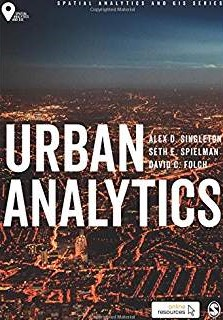

<!--html_preserve-->

    

      <h1 class="display-3">Alex Singleton</h1>
      
Professor of Geographic Information Science at the University of Liverpool.  If you are interested in my blog posts, these can now be found at the <a href="https://geographicdatascience.com/">Geographic Data Science Lab</a>.

      
<a class="btn btn-primary btn-lg" href="publications.html" role="button">My publications</a>

    

 

    

      

        

          <h2>MSc Geographic Data Science</h2>
          
          
University of Liverpool established the world's first MSc in Geographic Data Science, and is accepting applications. Click <a href="https://www.liverpool.ac.uk/study/postgraduate/taught/geographic-data-science-msc/overview/">here</a> to get an overview of the course and find out how to apply.

        

        

          <h2>Geographic Data Science Lab</h2>
          
          
<a href = "https://geographicdatascience.com/">GDSL</a> are a collective of researchers with interests in the fusion of Data Science, GIS and their appropriate use. Our  website is <a href = "https://www.liverpool.ac.uk/geographic-data-science/">here</a>. We are always interested in hearing from new collaborators and welcome visitors.

       

      

 

        

        	<h2>Biography</h2>
          	
 I am a Professor of Geographic Information Science at the University of Liverpool, Deputy Director of the <a href="http://www.cdrc.ac.uk">ESRC Consumer Data Research Centre</a> (CDRC) and Director of the <a href="http://datacdt.org/
" >ESRC Data Analytics & Society CDT</a>. In a general sense my research is concerned with how the complexities of individual behaviours, attitudes and contexts manifest spatially, and can be represented and understood though a framework of geographic data science.

			
I am particularly interested in applications of area classification to understand multidimensional socio-spatial structure, and I have developed a broad critique of the ways in which such geodemographic methods can be refined through modern scientific approaches of machine learning, geographic information science and quantitative human geography. I am an avid R user, and also advocate of <a href="http://dx.doi.org/10.1080/13658816.2015.1137579">Open Geographic Information Science</a>.

        

        

        <h2>Urban Analytics</h2>
        

			
For more information about my book Urban Analytics see the <a href="https://uk.sagepub.com/en-gb/eur/urban-analytics/book249267">publishers</a> page, or for supporting materials my <a href = "https://github.com/alexsingleton/urban_analytics
">github</a>.

		

<!--/html_preserve-->